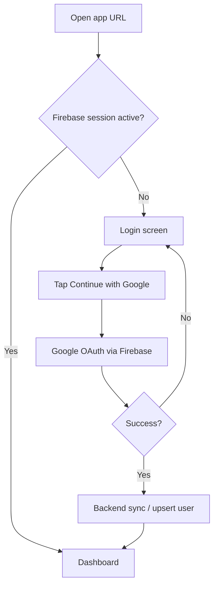
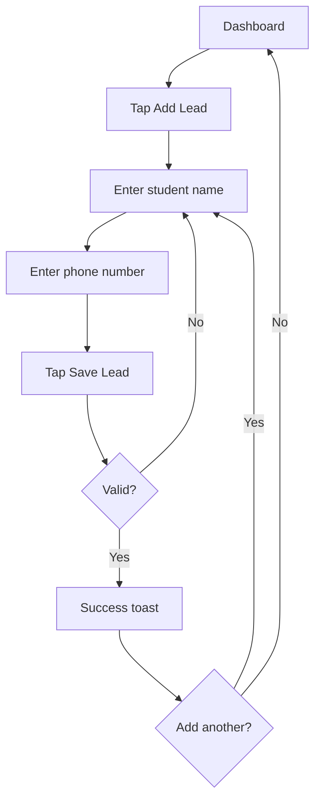
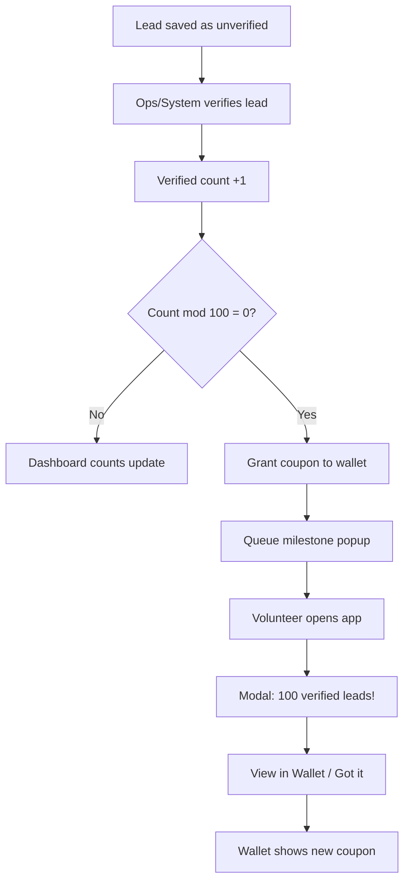
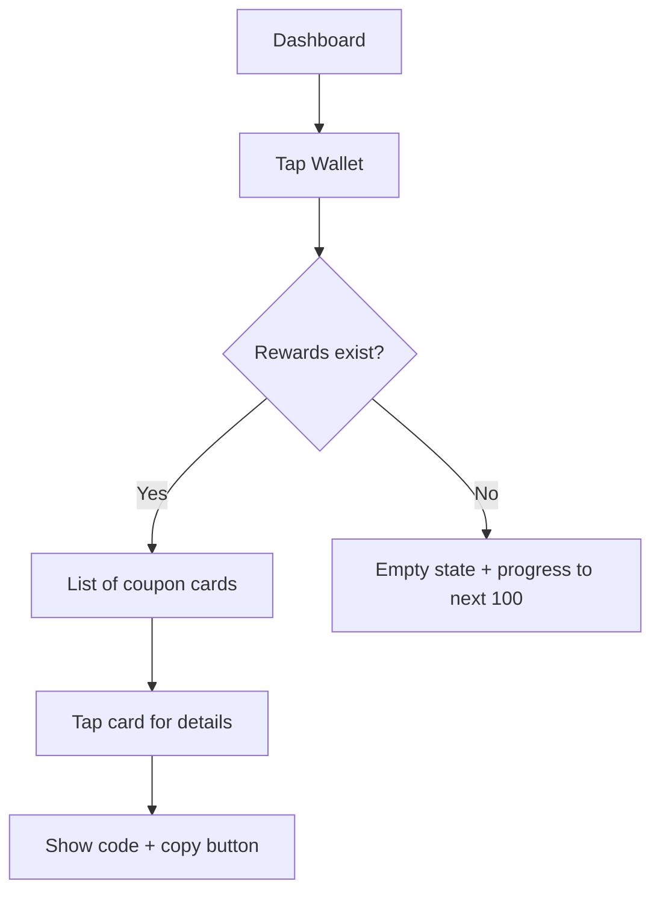

# Design Document
## Infinity Runner — Volunteer Lead Collection App

| Field | Value |
|-------|-------|
| **Version** | 0.1 (Draft) |
| **Date** | June 11, 2026 |
| **Status** | Draft |
| **Related** | [PRD.md](./PRD.md), [TECH_DOC.md](./TECH_DOC.md) |

---

## 1. Design Principles

| Principle | Application |
|-----------|-------------|
| **Mobile-first** | Primary layout 360–414px; thumb-friendly targets (min 44px) |
| **Speed** | Add a lead in minimal taps; default keyboard = phone pad |
| **Clarity** | Verified vs. unverified always visible; no jargon |
| **Delight** | Milestone popup celebrates achievement without blocking work long |
| **Trust** | Wallet shows real coupon value; professional Infinity Learn branding |
| **Field-ready** | High contrast, readable in sunlight; works one-handed |

---

## 2. Brand & Visual Direction

> Extracted from [54_IL_Web](https://www.figma.com/design/uRhDNtLgAYOma6RH80TSON/54_IL_Web?node-id=3-19968) Home screen reference. Full token list: [brand-tokens.md](./brand-tokens.md).

| Token | Value | Usage |
|-------|-------|-------|
| Primary | `#0162C9` (blue-30) | Sidebar, CTAs, links, progress |
| Primary dark | `#012F63` (blue-10) | Banners, deep accents |
| Primary light | `#E6F2FF` (blue-90) | Active tab bg, tints |
| Success | `#37C65A` / bg `#D5F5DE` | Verified leads |
| Warning | `#FFAB00` / bg `#FEEECC` | Unverified leads |
| Error / Live | `#EE413A` | Errors, live badges |
| Surface | `#FFFFFF` / `#F1F2F6` | Cards / page background |
| Text primary | `#101010` | Headings, body |
| Text muted | `#666666` | Secondary labels |
| Pastel accents | blue-90, success-95, yellow-95 | Stat cards, highlights |
| Font | Inter, system-ui | Matches IL web |
| Radius | 16px cards, 12px buttons, 8px inputs | IL card pattern |
| Spacing unit | 4px base (8, 16, 24, 32) | Consistent rhythm |

**Logo:** Official asset at `frontend/public/logo-white.png` — Infinity Learn wordmark, chevron, "BY SRI CHAITANYA". Login uses black card; sidebar uses white-on-blue blend.

---

## 3. Information Architecture

```
Infinity Runner
├── Auth
│   └── Login (Google sign-in — also registers first-time users)
├── Dashboard (home)
│   ├── Stats summary
│   ├── Add Lead (primary action)
│   └── Wallet entry
├── Leads
│   ├── New Lead (form)
│   └── My Leads (list) [optional v1]
├── Wallet
│   ├── Reward cards
│   └── Empty state
└── Profile / Settings
    ├── Name, email (from Google)
    └── Sign out
```

---

## 4. User Flows

### 4.1 Google sign-in (login + first-time registration)



*Single entry point: Google sign-in handles both new and returning volunteers. No volunteer phone collection — Google profile is enough.*

### 4.2 Add lead (core loop)



**UX notes:**
- Auto-focus name field on open
- Phone field uses `tel` input; India country code hint (+91)
- Sticky bottom "Save Lead" button
- After save, form clears for rapid next entry

### 4.3 Verification & milestone (system-driven)



### 4.4 Wallet viewing



---

## 5. Screen Specifications

### 5.1 Login (Google only)

**Purpose:** Authenticate volunteers via Firebase Google sign-in. First-time users are registered automatically after Google OAuth succeeds.

| Element | Specification |
|---------|---------------|
| Header | Infinity Runner logo + tagline |
| Subtext | "Sign in with your Google account to continue" |
| Primary CTA | **"Continue with Google"** — full width, Google branding guidelines |
| Google button | White background, Google "G" logo, standard padding |
| Error | Toast or inline: "Sign-in failed. Please try again." |
| Loading | Button disabled + spinner during OAuth |
| No other options | No email/password fields, no separate Register link |

**Wireframe (ASCII):**
```
┌─────────────────────────────┐
│      [Infinity Logo]        │
│      Infinity Runner        │
│                             │
│  Collect leads. Earn        │
│  rewards.                   │
│                             │
│  ┌─────────────────────┐    │
│  │ G  Continue with    │    │
│  │    Google           │    │
│  └─────────────────────┘    │
│                             │
│  For Infinity volunteers    │
└─────────────────────────────┘
```

**Mobile/PWA note:** Use `signInWithRedirect` on mobile browsers to avoid popup blockers; show loading state during redirect return.

**Post-sign-in:** User goes **directly to dashboard**. Volunteer phone number is not collected.

---

### 5.2 Dashboard (Home)

**Purpose:** Hub for stats, add lead, wallet.

| Section | Content |
|---------|---------|
| **Header** | Greeting: "Hi, {first name}" + Google avatar / profile icon |
| **Stats card** | Three metrics in a row or stacked |
| | • Verified leads (green accent) |
| | • Unverified leads (amber accent) |
| | • Progress to next reward: e.g., "87 / 100 verified" with progress bar |
| **Primary CTA** | Large "Add Lead" button (fixed or prominent) |
| **Secondary** | Wallet tile: "My Rewards" with badge if new coupon |
| **Nav** | Bottom tab bar: Home · Add Lead · Wallet · Profile (optional) |

**Wireframe:**
```
┌─────────────────────────────┐
│ Hi, Priya            [👤]   │
├─────────────────────────────┤
│  YOUR LEADS                 │
│  ┌───────┬───────┬───────┐  │
│  │  87   │  23   │  110  │  │
│  │Verified│Unver.│ Total │  │
│  └───────┴───────┴───────┘  │
│                             │
│  Next reward                │
│  ████████░░  87/100         │
│                             │
│  ┌─────────────────────┐    │
│  │    ＋  Add Lead      │    │
│  └─────────────────────┘    │
│                             │
│  ┌─────────────────────┐    │
│  │  🎁 My Wallet   (1)  │    │
│  └─────────────────────┘    │
├─────────────────────────────┤
│  Home    +    Wallet  Profile│
└─────────────────────────────┘
```

---

### 5.3 Add Lead

**Purpose:** Capture student name and phone quickly.

| Field | Rules |
|-------|-------|
| Student name | Required, 2–100 chars |
| Phone | Required, 10-digit India mobile |

| Element | Behavior |
|---------|----------|
| Save button | Disabled until valid |
| Cancel | Returns to dashboard |
| Success | Green toast: "Lead saved" + tallies update |
| Error | Red toast: network / validation |

**Wireframe:**
```
┌─────────────────────────────┐
│  ←  Add Lead                │
├─────────────────────────────┤
│                             │
│  Student name *             │
│  ┌─────────────────────┐    │
│  │                     │    │
│  └─────────────────────┘    │
│                             │
│  Phone number *             │
│  ┌─────────────────────┐    │
│  │ +91                 │    │
│  └─────────────────────┘    │
│                             │
│                             │
│  ┌─────────────────────┐    │
│  │    Save Lead        │    │
│  └─────────────────────┘    │
└─────────────────────────────┘
```

---

### 5.4 Milestone Popup (Modal)

**Purpose:** Celebrate 100 verified leads and announce reward.

**Trigger:** On dashboard load or after count sync when `verified % 100 === 0` and not yet acknowledged.

| Element | Specification |
|---------|---------------|
| Overlay | Semi-transparent; blocks interaction until dismissed |
| Icon | Trophy / confetti animation (subtle, performant) |
| Headline | "Congratulations!" |
| Body | "You have successfully collected **{X} verified leads**!" |
| Reward line | "You've received an **Amazon coupon (₹500)**" |
| Primary CTA | "View in Wallet" → navigates to wallet, dismisses modal |
| Secondary | "Continue" — dismiss only |

**Wireframe:**
```
┌─────────────────────────────┐
│░░░░░░░░░░░░░░░░░░░░░░░░░░░░░│
│░░  ┌───────────────────┐  ░░│
│░░  │       🏆          │  ░░│
│░░  │ Congratulations!  │  ░░│
│░░  │                   │  ░░│
│░░  │ You collected     │  ░░│
│░░  │ 100 verified      │  ░░│
│░░  │ leads!            │  ░░│
│░░  │                   │  ░░│
│░░  │ Amazon coupon     │  ░░│
│░░  │ earned 🎁         │  ░░│
│░░  │                   │  ░░│
│░░  │ [View in Wallet]  │  ░░│
│░░  │    Continue       │  ░░│
│░░  └───────────────────┘  ░░│
│░░░░░░░░░░░░░░░░░░░░░░░░░░░░░│
└─────────────────────────────┘
```

**Accessibility:** Focus trap in modal; `aria-modal="true"`; ESC closes with "Continue" equivalent.

---

### 5.5 Wallet

**Purpose:** Display earned rewards.

#### Populated state
Each reward = card:
- Reward type icon (Amazon)
- Title: "Amazon Coupon — ₹500"
- Subtitle: "Earned at 100 verified leads · 11 Jun 2026"
- Status badge: Active / Redeemed
- Tap → detail sheet with coupon code + **Copy** button

#### Empty state
- Illustration (gift box)
- "No rewards yet"
- "Collect 100 verified leads to earn your first Amazon coupon"
- Progress bar from dashboard data

**Wireframe (list):**
```
┌─────────────────────────────┐
│  ←  My Wallet               │
├─────────────────────────────┤
│  ┌─────────────────────┐    │
│  │ 🛒 Amazon Coupon    │    │
│  │ ₹500 · Active       │    │
│  │ 100 leads milestone │    │
│  └─────────────────────┘    │
│  ┌─────────────────────┐    │
│  │ 🛒 Amazon Coupon    │    │
│  │ ₹500 · Redeemed     │    │
│  │ 200 leads milestone │    │
│  └─────────────────────┘    │
└─────────────────────────────┘
```

**Coupon detail sheet:**
```
┌─────────────────────────────┐
│  Amazon Coupon         ✕    │
│  ─────────────────────────  │
│  Value: ₹500                │
│  Code:                      │
│  ┌─────────────────────┐    │
│  │ AMZN-XXXX-XXXX      │ 📋 │
│  └─────────────────────┘    │
│  Valid till: 31 Dec 2026    │
│  How to redeem: ...         │
└─────────────────────────────┘
```

---

## 6. Component Library

| Component | Variants | Notes |
|-----------|----------|-------|
| `Button` | primary, secondary, ghost | Full-width on mobile forms |
| `Input` | text, tel | With error state |
| `StatCard` | verified, unverified, total | Color-coded |
| `ProgressBar` | to-next-100 | Shows remainder |
| `LeadForm` | — | Name + phone |
| `MilestoneModal` | — | Celebration + CTAs |
| `WalletCard` | active, redeemed | Tappable |
| `CouponSheet` | — | Bottom sheet on mobile |
| `Toast` | success, error | Auto-dismiss 3s |
| `BottomNav` | 4 items | Fixed bottom |
| `EmptyState` | wallet, leads | Illustration + copy |

---

## 7. Interaction & Motion

| Interaction | Motion |
|-------------|--------|
| Milestone modal enter | Scale 0.95→1 + fade, 200ms |
| Confetti | Light CSS particles or Lottie; max 2s |
| Progress bar update | Width transition 300ms |
| Toast | Slide up from bottom |
| Page transitions | Simple fade; no heavy animation on low-end devices |
| Copy coupon | Haptic feedback (if PWA supports) + "Copied!" toast |

**Reduce motion:** Respect `prefers-reduced-motion`; skip confetti.

---

## 8. Responsive Breakpoints

| Breakpoint | Layout |
|------------|--------|
| &lt; 640px | Single column; bottom nav; full-width CTAs |
| 640–1024px | Centered max-width 480px card on dashboard |
| &gt; 1024px | Same as tablet (volunteers unlikely on desktop) |

---

## 9. PWA Install Experience

| Touchpoint | Design |
|------------|--------|
| First visit banner | "Install Infinity Runner for quick access" + Install / Later |
| iOS Safari | Instructions sheet: Share → Add to Home Screen |
| Installed | `standalone` mode hides browser chrome; status bar theme color |
| Icon | Infinity Learn mark; 192px and 512px |

---

## 10. Copy & Messaging

| Context | Copy |
|---------|------|
| Login screen | "Sign in with your Google account to continue" |
| First sign-in | Redirect straight to dashboard (no extra steps) |
| Dashboard empty leads | "Add your first lead to get started" |
| Lead saved | "Lead saved successfully" |
| Milestone | "You have successfully collected {n} verified leads!" |
| Wallet empty | "Your rewards will appear here" |
| Verified badge | "Verified" |
| Unverified badge | "Pending verification" |
| Error network | "Couldn't save. Check connection and try again." |

---

## 11. Edge Cases & Error States

| Scenario | UX |
|----------|-----|
| Firebase session expired | Redirect to login; toast: "Please sign in again" |
| Google sign-in cancelled | Stay on login; no error toast (user chose to cancel) |
| Duplicate phone (same volunteer) | Warning: "You already added this number today" |
| Milestone but no coupon stock | Modal: "Reward processing — check wallet soon" + ops alert |
| Offline lead save (Phase 2) | "Saved offline — will sync when online" |
| Invalid phone | Inline: "Enter a valid 10-digit mobile number" |
| Wallet coupon expired | Grey card + "Expired" badge |

---

## 12. Accessibility Checklist

- [ ] All form fields have visible labels
- [ ] Color contrast ≥ 4.5:1 for text
- [ ] Modal focus trap and keyboard dismiss
- [ ] Touch targets ≥ 44×44px
- [ ] Screen reader announces milestone and toast
- [ ] Copy button has accessible name

---

## 13. Design Deliverables (Next Steps)

| Deliverable | Tool | Owner |
|-------------|------|-------|
| High-fidelity mockups (mobile) | Figma | Design |
| Infinity Learn brand tokens | Figma variables | Design + Brand |
| Interactive prototype (add lead → milestone) | Figma | Design |
| Icon set + PWA assets | Figma / export | Design |
| Usability test with 3–5 volunteers | Field | Product |

---

## 14. Open Design Questions

| # | Question |
|---|----------|
| DQ-1 | Official Infinity Learn logo, colors, typography? |
| DQ-2 | Hindi or bilingual UI needed at launch? |
| DQ-3 | Show individual lead list to volunteers in v1? |
| DQ-4 | Exam center picker on add-lead form? |
| DQ-5 | Illustration style for empty states and milestone? |

---

*Auth flow is locked (Firebase Google). Design implementation can proceed; align brand assets when available.*
